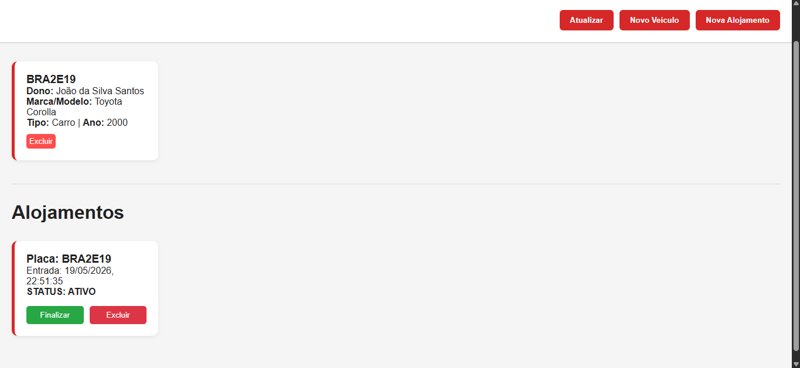

# Estacionamento - Sistema de Gestão

Sistema web completo para gerenciamento de pátio, desenvolvido para controlar o cadastro de veículos e o fluxo de alojamentos com cálculo automatizado de valores.

## Demonstração

| Tela Inicial | Cadastro de Veículos |
|---|---|
| 

---

## Especificações da API

Para o funcionamento correto da integração, o Back-end exige que o objeto de veículo contenha exatamente estes campos:

```json
{
  "placa": "AAA2222",
  "proprietario": "João Silva",
  "tipo": "Carro",
  "modelo": "Pulse",
  "marca": "Fiat",
  "cor": "Cinza Escuro",
  "ano": 2022,
  "telefone": "11 89563201"
}

```

---

## Como Iniciar o Projeto

### 1. Configurando o Back-end (API ACME)

1. Acesse o diretório da API:
```bash
cd api

```


2. Instale as dependências:
```bash
npm install


```

```
3. Prepare o banco de dados (Prisma):
   ```bash
   npx prisma generate
   npx prisma migrate dev --name init

```

4. Inicie o servidor:
```bash
npm start


```

```

2. Iniciando o Front-end
O Front-end utiliza HTML, CSS e JavaScript puros:

1. Localize a pasta raiz do projeto.
2. Abra o arquivo `index.html` diretamente no seu navegador.
3. Certifique-se de que o servidor Node.js (Back-end) está ativo para que os cards sejam carregados.

---

Como Testar

Teste de Fluxo Completo
1. Cadastrar Veículo: Clique em "Novo Veículo", preencha os campos (Placa, Proprietário, Marca, etc.) e salve. O card deve aparecer imediatamente na lista.
2. Registrar Entrada: Clique em "Nova Alojamento", insira a placa de um veículo já cadastrado e defina o valor por hora.
3. Monitorar Alojamento: O card aparecerá na seção de alojamentos com o status Ativo.
4. Finalizar Alojamento: No card da alojamento, clique no botão Finalizar. 
   - O sistema registrará o horário de saída.
   - O valor total será calculado com base no tempo de permanência.
   - O card mudará para a cor Azul (Finalizada).
5. Excluir Dados: Teste os botões de exclusão em ambos os módulos para validar a remoção no banco de dados.

Validação de Endpoint (via Insomnia)
Para testar a recepção de dados diretamente na API:
- Método: `POST`
- URL: `http://localhost:3000/carro/cadastrar`
---

```

```

```
